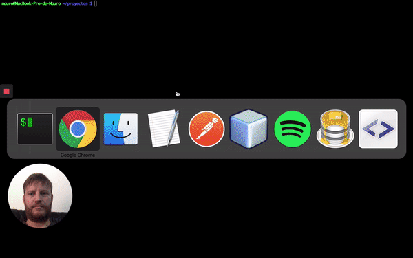

# REST API IN SLIM PHP

Example of REST API with [Slim PHP micro framework](http://www.slimframework.com).


This simple RESTful API made in Slim version 3, allows CRUD operations to manage resources like: Users, Tasks and Notes.

[](https://travis-ci.org/maurobonfietti/rest-api-slim-php)
[](https://codeclimate.com/github/maurobonfietti/api-rest-slimphp/coverage)
[](https://scrutinizer-ci.com/g/maurobonfietti/api-rest-slimphp/?branch=master)
[](https://sonarcloud.io/dashboard?id=maurobonfietti_rest-api-slim-php)

You can also read this [README IN SPANISH](README_SPANISH.md).

More info about this project in my post: [How to create a REST API using Slim PHP](https://maurobonfietti.github.io/2019-06-03-rest-api-slim-php/).

I implemented this API in [this project](https://github.com/maurobonfietti/rest-api-slim-php-web-app). It's a todo list web app developed in Angular.


## QUICK INSTALL:

### Pre Requisite:

- Git.
- Composer.
- PHP.
- MySQL/MariaDB.

### Run commands:

In your terminal execute this commands:

```bash
$ git clone https://github.com/maurobonfietti/rest-api-slim-php.git && cd rest-api-slim-php
$ cp .env.example .env
$ composer install
$ composer database
$ composer start
```

[](https://youtu.be/xQfTcKbD7NI)


## STEP BY STEP:

### 1- Clone project and install dependencies:

```bash
$ git clone https://github.com/maurobonfietti/rest-api-slim-php.git
$ cd rest-api-slim-php
$ cp .env.example .env
$ composer install
```


### 2- Create a new MySQL database. For example: "rest_api_slim_php".

From the command line run:

```bash
$ mysql -e 'CREATE DATABASE rest_api_slim_php;'
```


### 3- Create the structure and load test data into the database.

The database can be updated manually using the following file: [database.sql](database/database.sql).

It can also be run from the command line:

```bash
$ mysql rest_api_slim_php < database/database.sql
```


### 4- Configure the connection data with MySQL.

Edit and complete configuration file: `.env`. For example:

```
DB_HOSTNAME = '127.0.0.1'
DB_DATABASE = 'rest_api_slim_php'
DB_USERNAME = 'root'
DB_PASSWORD = ''
```


### 5- Configure optional environment variables.

For example:

```
DISPLAY_ERROR_DETAILS=true
APP_DOMAIN='https://www.yourdomain.com'
USE_REDIS_CACHE=false
REDIS_URL=''
SECRET_KEY='YourSuperSecret-KeY'
```


## LOCAL SERVER:

You can start the PHP internal web server by running:

```bash
$ composer start
```


### NOTE:

If everything went well :sunglasses:, you can access the project locally by entering:
[Help](http://localhost:8080), 
[Status](http://localhost:8080/status) and
[Notes](http://localhost:8080/api/v1/notes).

The `composer start` command would be the equivalent to execute:

```bash
$ php -S 0.0.0.0:8080 -t public public/index.php
```


## DEPENDENCIES:

### LIST OF REQUIRE DEPENDENCIES:

- [slim/slim](https://github.com/slimphp/Slim): Slim is a PHP micro framework that helps you quickly write simple yet powerful web applications and APIs.
- [respect/validation](https://github.com/Respect/Validation): The most awesome validation engine ever created for PHP.
- [palanik/corsslim](https://github.com/palanik/CorsSlim): Cross-origin resource sharing (CORS) middleware for PHP Slim.
- [vlucas/phpdotenv](https://github.com/vlucas/phpdotenv): Loads environment variables from `.env` to `getenv()`, `$_ENV` and `$_SERVER` automagically.
- [predis/predis](https://github.com/phpredis/phpredis): A PHP extension for Redis.
- [firebase/php-jwt](https://github.com/firebase/php-jwt): A simple library to encode and decode JSON Web Tokens (JWT) in PHP.

### LIST OF DEVELOPMENT DEPENDENCIES:

- [phpunit/phpunit](https://github.com/sebastianbergmann/phpunit): The PHP Unit Testing framework.
- [phpstan/phpstan](https://github.com/phpstan/phpstan): PHPStan - PHP Static Analysis Tool.


## TESTS:

Access the root of the project and run all tests PHPUnit with `composer test`.

```bash
PHPUnit 8.2.3 by Sebastian Bergmann and contributors.

...........................................................                                                                                                            59 / 59 (100%)

Time: 243 ms, Memory: 14.00 MB

OK (59 tests, 320 assertions)
```


## DOCUMENTATION:

### ENDPOINTS:

- Help: `GET /`

- Status: `GET /status`

- Login User: `POST /login`

- Create User: `POST /api/v1/users`

- Update User: `PUT /api/v1/users/{id}`

- Delete User: `DELETE /api/v1/users/{id}`

- Get All Tasks: `GET /api/v1/tasks`

- Get One Task: `GET /api/v1/tasks/{id}`

- Search Tasks: `GET /api/v1/tasks/search/{string}`

- Create Task: `POST /api/v1/tasks`

- Update Task: `PUT /api/v1/tasks/{id}`

- Delete Task: `DELETE /api/v1/tasks/{id}`

Also, you can see the API documentation with the [full list of endpoints](extras/docs/endpoints.md).


### IMPORT WITH POSTMAN:

All the information of the API, prepared to download and use as postman collection: [Import Collection](https://www.getpostman.com/collections/b8493a923ab81ef53ebb).

[](https://app.getpostman.com/run-collection/b8493a923ab81ef53ebb)


### HELP AND DOCS:

For more information on how to use the REST API, see the following documentation available on [Postman Documenter](https://documenter.getpostman.com/view/1915278/RztfwByr).


## GIVE IT A TRY:

[](https://heroku.com/deploy)

Check it out to this [live demo](http://bit.ly/2DdwKkd) hosted on Heroku.
